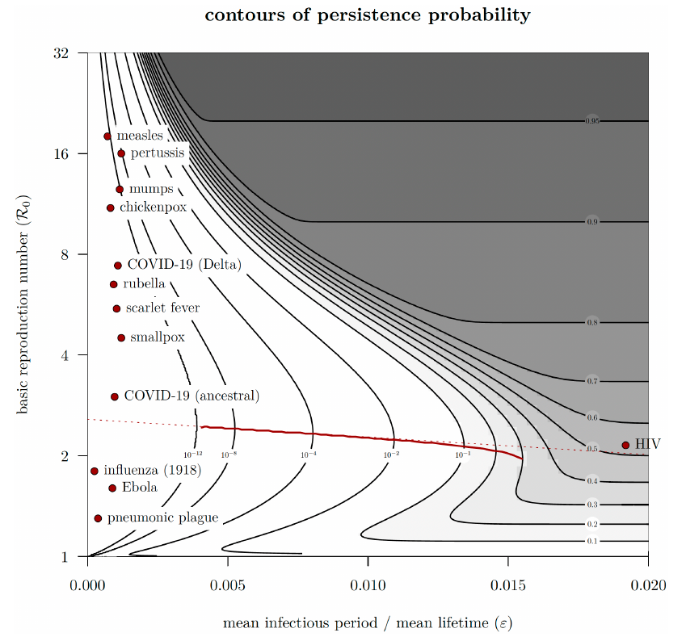

<!-- https://github.com/quarto-dev/quarto-cli/discussions/7003 -->

```{css}
/*| echo: false */
figcaption {
  margin: auto;
  text-align: center;
}
```

$$
\newcommand{\rzero}{{\cal R}_0}
$$

What are some biologically and dynamically plausible explanations for the repeated evolution of PLA-depleted strains of *Y. pestis* in the late stages of pandemics?

The epidemiogically relevant characteristics of PLA-depleted strains are that they are less likely to kill their rat hosts than the wild type [^1], and that they *may* take longer to kill them[^2]. While these changes might initially suggest that plague is evolving according to a classical transmission-virulence tradeoff [@Lens1988; @LensMay1994; @Cres+2016], the natural history of plague does not fit the standard tradeoff theory, which assumes that pathogens transmit over a significant fraction of their generation interval - so that a longer (slower) generation interval will correspond to a proportionally greater $\rzero$. 
In contrast, plague only transmits from one rat to another when the initial host dies and its fleas seek a new host (at least in the case of bubonic transmission), so the infectious period is only a brief moment at the end of the initial host's life. 
[JD: The above is a bit too strong, even if the common wisdom is right. But I'm having trouble thinking that fleas never get crowded and disperse from living rats. We should be a bit cautious and/or investigate a bit more.]
Since PLA-depleted strains also have lower case mortality, they have lower transmission potential (assuming equal flea populations and lower or equal rat-to-flea transmission probability), no lengthening of infectious period, and hence intrinsically lower $\rzero$.

In general, pathogens with higher $\rzero$ are competitively dominant in an endemic setting; those with a higher growth rate $r$ (for the same $\rzero$, faster strains with a shorter generation interval have higher $r$) are competitively dominant in the early phase of an epidemic [@Fran1996]. Pathogens with *lower* $r$ dominate in the late phase of an epidemic, because they decline slower, but a high-$r$ strain will infect more total hosts over the course of an epidemic (assuming the epidemic starts with equal numbers of hosts infected with each strain).
[JD: “lower” is not right here; what we want is presumably to talk about faster and slower pathogens]

Since we cannot come up with a plausible scenario where a lower-$\rzero$, lower-$r$ strain could become competively dominant at the level of a single host population, we turn to metapopulation models (previously used by @KeelGill2000 to explore the long-term persistence of plague). In contrast to @KeelGill2000's model, we will limit ourselves to simple *patch occupancy* models [@LeviCulv1971] that (we hope) will help us understand the possible competitive outcomes of between-strain competition.

In a competitive patch occupancy model, the metapopulation-level outcome is determined by (1) extinction rates of both strains (in this case, the rate or probability per unit time of a subpopulation epidemic composed of one or both strains dying out); (2) colonization rates (the rate at which new epidemics are initiated by immigration of plague-infected rats or fleas from another subpopulation); and (3) what happens when a host population is simultaneously infected by both strains (i.e., coexistence or exclusion at the subpopulation level). 

We would expect that the wild-type, with a higher $\rzero$ and $r$, will competitively displace the PLA-depleted strain at the subpopulation level (for simplicity, we assume that displacement occurs instantaneously[^3]). Therefore, it is impossible for the PLA-depleted strain to outcompete the wild type at the metapopulation level – the PLA-depleted strain does not affect the wild-type's population dynamics at all in this model, but it is possible that the PLA-depleted strain could persist under circumstances where the wild type cannot persist (even in the absence of the PLA-depleted strain).

We expect that the colonization (between-patch transmission) rate is similar for both strains (although a longer generation time could in principle give a rat infected with the PLA-depleted strain a slightly greater probability of dispersing between patches). This leaves us asking whether having a *lower* $\rzero$ at the within-patch level could provide a competitive advantage at the metapopulation level, through lowered extinction rates; this is an example of the "prudent predator" phenomenon where phenotypes that underexploit their resource can evolve in patchy environments [@bootsSmall1999; @claessenEvolution1995; @keelingReinterpreting2000b; @maySuperinfection1994a; @Pels+2002].

In particular, we can use insights from a recent analysis of epidemic *burnout*, the phenomenon where a pathogen goes extinct during the first epidemic trough following its introduction to a population [@Pars+2024]. The probability of burnout depends primarily on $\rzero$ and on the ratio of infectious period (or generation interval) to host lifespan ($\varepsilon$). For plague in rats these parameters are *approximately* $\rzero \approx 1.5-3$ and $\varepsilon \approx 0.01$,[^4] which puts the persistence probability at approximately 1%. More importantly (because many epidemiological details could affect these order-of-magnitude estimates from a simple model), the $\rzero$ of wild-type plague puts it near the minimum persistence, such that the decreased $\rzero$ of the PLA-depleted strain could indeed drastically decrease its probability of extinction.

```{r parsons-fig, echo = FALSE, fig.width = 7, fig.align = "center"}
#| fig.cap = "Figure 5 from @Pars+2024."

```

So here (after all that) is our working hypothesis: in the early stages of an epidemic, the rat population is large and spatially connected enough (colonization rates are high) to allow the persistence of the wild type at the population level, even though its probability of persisting through the first epidemic trough is very low (high extinction rates). The pandemic itself leads to a metapopulation-wide decrease in the density of the rat population and the connectedness of subpopulations[^5], leading to a decrease in colonization rates and extinction of the wild type. In contrast, the lower $\rzero$ of the PLA-depleted strain, which handicapped it in competing with the wild type strain in the early phase of the epidemic, lowers its local extinction rate sufficiently that it is able to persist at the metapopulation level even when colonization rates are low.

## Some computations and quantification

* I have no idea what a reasonable subpopulation size of rats would be. The computations in @Pars+2024 are all based (arbitrarily) on a population size of $N=10^6$. 
   * a mark-recapture study by a pest control company [@Sanc2023] estimated 3 million rats in NYC in 2023 (mostly brown rats)
   * presumably @KeelGill2000 have some population sizes we can use?
   * @Yu+2022 give *global* palaeodemographic estimates for black rats, but I have no idea how census population size relates to effective population size ($N = 10 N_e$? $N = 10^4 N_e$?)
   * I'm going to use $N=10^6$ for now.
* We should be able to get a range of $\rzero$ estimates for *Y. pestis* (including from our own papers). I'm going to use $\rzero=2.5$ for wild-type and $\rzero=1.5$ for PLA-depleted (this is cheating a bit since I know that $\rzero=2.5$ is very close to the minimum persistence).
* as a very rough guess at $\varepsilon$ I'm going to assume that the infected period is 1 week and rat lifespan is 2 years, so $1/104 \approx 0.01$. Could probably get better numbers.
* we have no idea what colonization rates would be.

```{r burnout-probs}
library(burnout)
options(digits = 3)
(pw <- P1_prob(R0 = 2.5, epsilon = 0.01)) ## wild-type
(pd <- P1_prob(R0 = 1.5, epsilon = 0.01)) ## PLA-depleted
```
so the PLA-depleted have approximately `r round(pd/pw)` times higher probability of persistence ...[^6]

## Levins-Culver analysis

Parameters are $c_w$, $e_w$ (colonization and extinction rates of the wild-type); $c_d$, $e_d$ (ditto, depleted). The equations are

$$
\begin{split}
\frac{dW}{dt} & = W \left( c_w (1-W) - e_w \right) \\
\frac{dD}{dt} & = D \left( c_d (1-W-D) - e_d \right)
\end{split}
$$

* If $c_w > e_w$, wild type persists (in monoculture and in competition).
* If wild type persists its equilibrium occupancy is $1 -e_w/c_w$.
* If wild type persists depleted strain can coexist if $c_d (e_w/c_w) > e_d$.
* If wild type goes extinct depleted strain can survive if $c_d > e_d$.


---

[^1]: quantify: how much less likely?
[^2]: quantify!
[^3]: If displacement is not instantaneous, a lower-$r$ strain could have a colonization advantage over a higher-$r$ strain with the same $\rzero$ *if* between-patch colonization occurs preferentially during the decline phase of epidemics. However, it is hard to think of such a mechanism.
[^4]: quantify! quantify! quantify!
[^5]: we could also attribute such changes to exogenous ecological trends, but we would then have to explain similar trends occurred across all three pandemics
[^6]: we could (should) also think about/discuss how applicable the @Pars+2024 results are to plague. I think it's actually not too bad; from a 10,000-foot level, there's not that much difference between epidemic dynamics due to buildup of immunes who are gradually replaced by susceptibles vs. epidemic dynamics due to population collapse due to disease-induced mortality who are gradually replenished by new births ...
