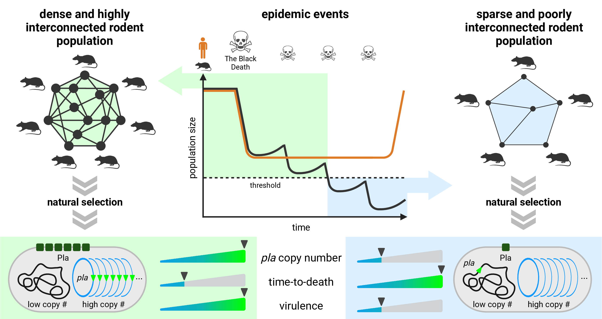
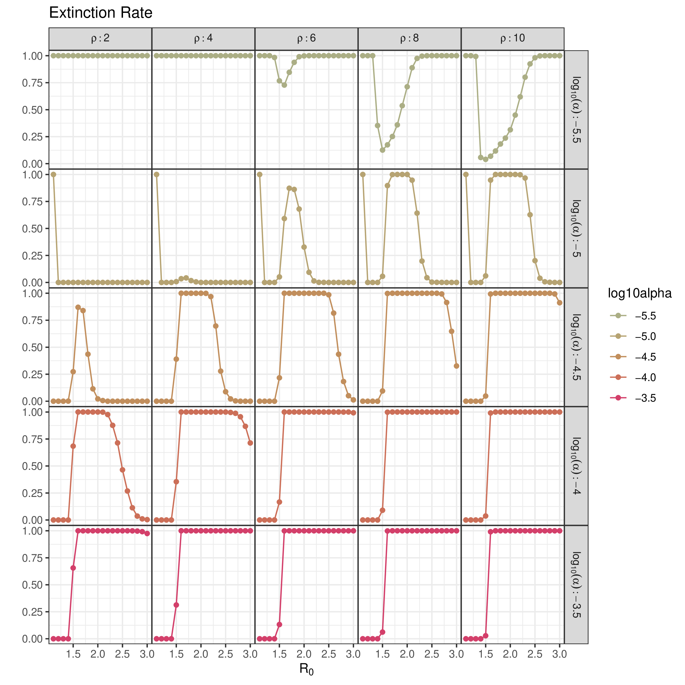
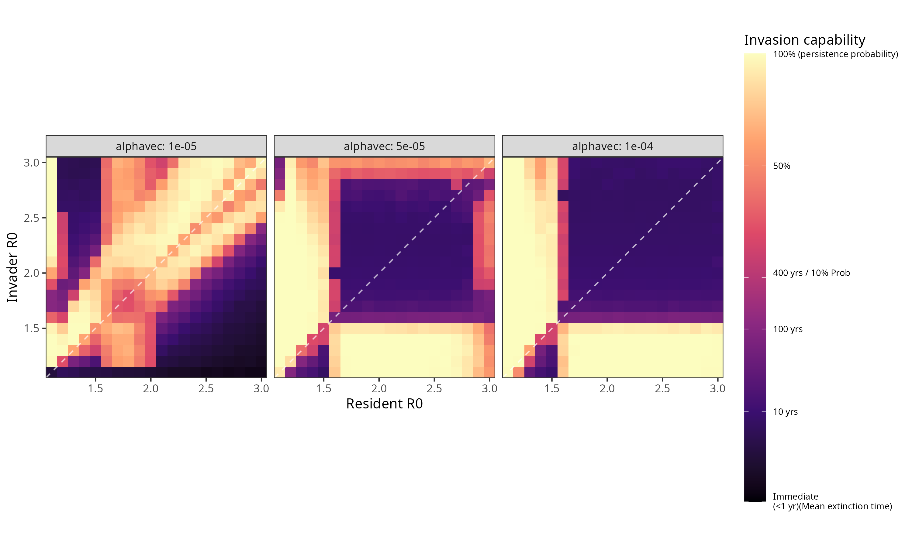
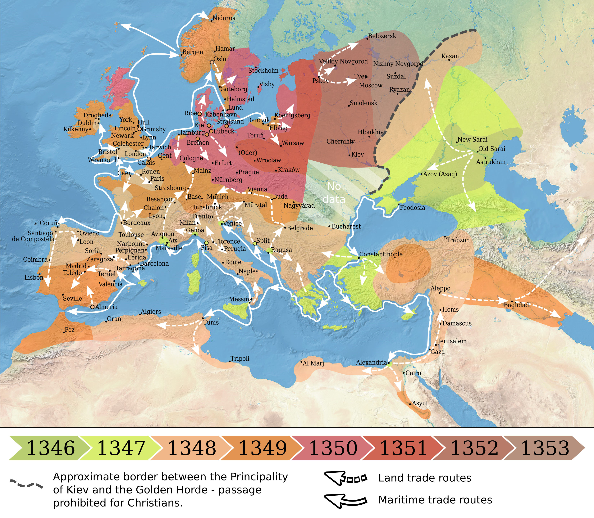
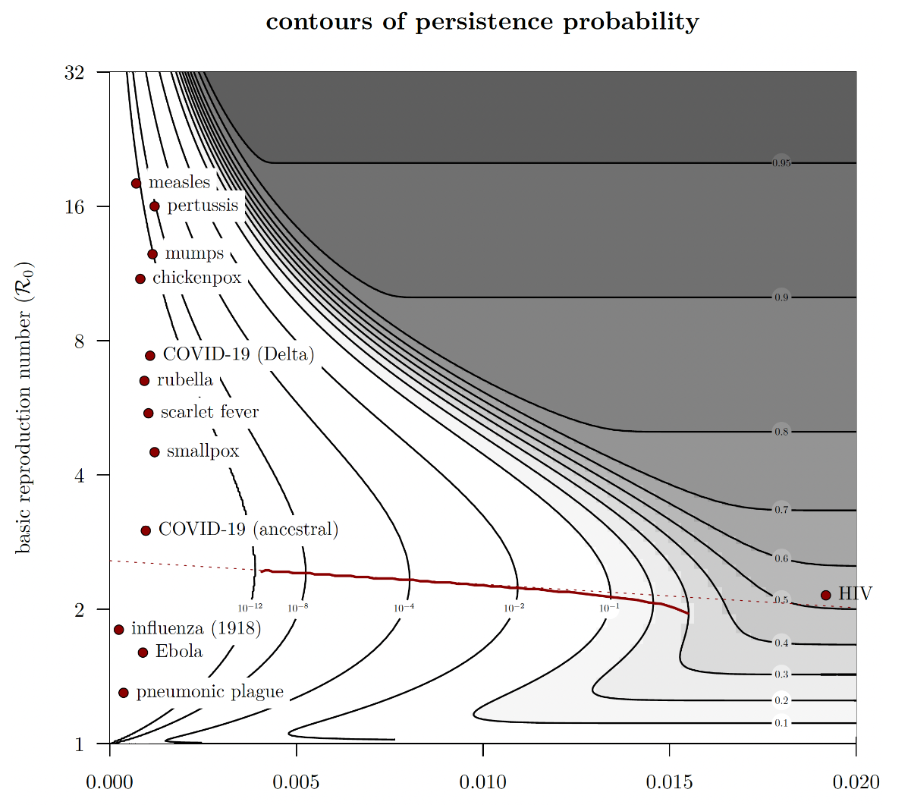
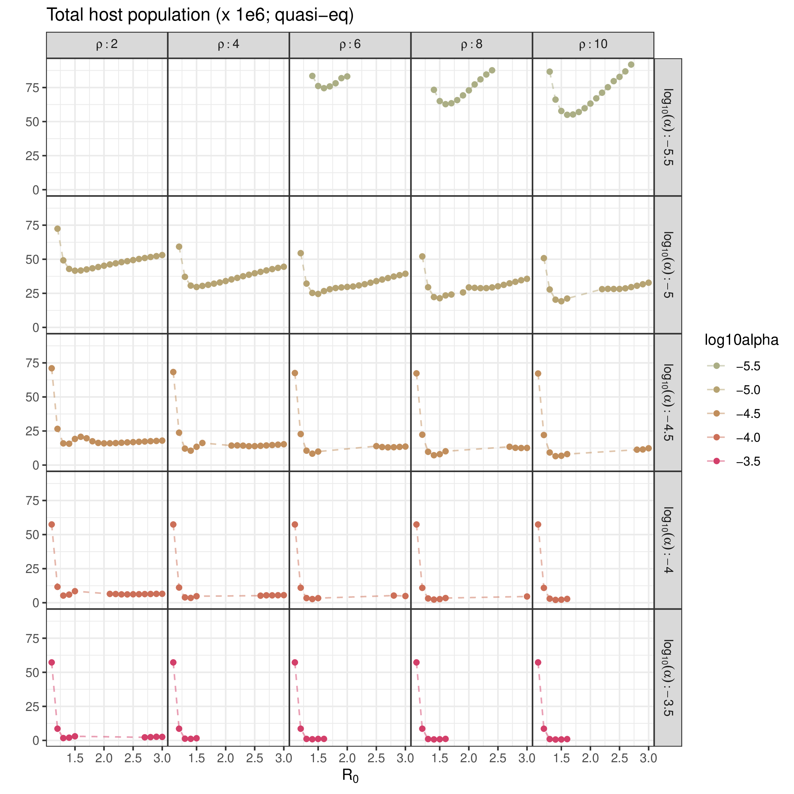

## the question

```{r setup, echo = FALSE, include = FALSE}
library(tidyverse); theme_set(theme_bw())
library(colorspace) ## lighten()
```

<!-- .refs is style for reference page (small text) -->
<style>
.refs {
   font-size: 14px;
}
.tiny {
   font-size: 8px;
}

h2 { 
 color: #3399ff;		
}
h3 { 
 color: #3399ff;		
}
.title-slide {
   background-color: #55bbff;
}
<!-- https://stackoverflow.com/questions/50378349/force-column-break-in-rmarkdown-ioslides-columns-2-layout -->
.forceBreak { -webkit-column-break-after: always; break-after: column; }
</style>

\newcommand{\rzero}{{\cal R}_0}


What (eco-)evolutionary dynamics drove the repeated evolution of reduced virulence in *Yersinia pestis* in multiple pandemics?

<!-- https://emilhvitfeldt.github.io/quarto-revealjs-editable/
  quarto add emilhvitfeldt/quarto-revealjs-editable
  https://emilhvitfeldt.github.io/quarto-revealjs-editable/getting-started.html
  -->

## acknowledgements

* **Yuyang Zhang** (張雨陽), Jonathan Dushoff, David Earn
* Ravneet Sidhu, Hendrik Poinar (ancient DNA work)
* NSERC ($$$)

## plague basics

* vector-borne bacterial disease of rodents
    * rats and fleas
* spillover into human populations
    * human-to-human (or human-vector-human) transmission possible, but unusual
* history:
    * originated Bronze Age, $\approx$ 5-6 KYBP
    * three **pandemics**: 540-750 AD, 1347-18th c., 1850-20th c.

## the inspiration 

::: {.absolute width=701px height=636px left=-258px top=125px}
* @sidhuAttenuationVirulenceYersinia2025 showed that *Y. pestis* **repeatedly** evolved a lower-virulence phenotype, in each pandemic
* via copy-number reduction of a plasmid-encoded virulence gene (*Pla*)
:::

{.absolute width=776.1px height=537.2px left=515.2px top=74.3px style="transform: rotate(-0.1deg);"}

## experimental mortality data

* mouse injections with varying levels of *Pla* depletion 
* infection mortality decreases, survival time increases

```{r sidhu-mort,echo = FALSE}
dd4 <- read.csv("Sidhu_mort.csv")  |>
    mutate(across(strain, \(x) reorder(factor(x), gene_ratio,
                                       decreasing = TRUE))) |>
    arrange(strain) |>
    mutate(strainx = sprintf("%s\n(%1.1f%% Pla)", strain, gene_ratio) |>
               factor() |> forcats::fct_inorder()) |>
    mutate(event = ifelse(dod==20, 0, 1)) ## censoring
cvec0 <- c("#69BE44", "#49A5DF", "#D5D5D8")
cvec1 <- c(cvec0[1],
           lighten(cvec0[2], c(-0.3, 0, 0.3)),
           cvec0[3])
cvec <- cvec1
theme_set(theme_bw(base_size = 16))

gg_ttd <- ggplot(dd4, aes(x=strainx, y = dod, colour = strain, fill = strain)) +
    geom_dotplot(binaxis="y", stackdir = "center", binwidth = 0.5) +
    geom_boxplot(alpha = 0.2) + 
    expand_limits(y=0) +
    scale_colour_manual(values = cvec) +
    scale_fill_manual(values = cvec) +
    theme(legend.position = "none") +
    labs(y = "day of death")

print(gg_ttd)
```

## tradeoff theory doesn't work here

::: {.absolute width=820.6px height=520px left=-257.6px top=161px}
* classical **tradeoff theory**:  
$\rzero \propto$ transmissibility ($\textrm{time}^{-1}$) × infectious period
* assumes transmission occurs continuously
* but fleas move/transmission occurs **at host death** (!)
* → *Pla* depletion uniformly **lowers** $\rzero$  
(and growth rate $r$)
:::

{.absolute width=373px height=63px left=634.9px top=51.6px}
{.absolute width=413.3px height=96.8px left=620px top=101.9px}
{.absolute width=434.8px height=480.8px left=608.7px top=205.4px}

## then how can this work?

* metapopulation dynamics
   * for plague persistence [@KeelGill2000b]
   * for virulence evolution (@bootsSmall1999, many others)
* lower local (**within-patch**) $\rzero$ could be evolutionarily advantageous

## graphical abstract

{.absolute width=1050px height=557px left=0px top=89px}

## metapopulation mechanisms

* **burnout** [@Pars+2024]: probability of local, stochastic disease extinction is highest at $\rzero \approx 2$
* **colonization limitation**: lower $\rzero$ → more surviving hosts → more colonization
* **density-dependent $\rzero$**: lower $\rzero$ → more surviving hosts → **larger** epidemics (???)

## models

* extremely simplified
* discrete-time, one epidemic per time step ($\approx$ annual)
    * analytical patch occupancy models
	* stochastic metapopulation model

## model steps

* **growth**: logistic growth of rat population
* **host colonization**: rat movement among patches
* **epidemic initiation**
   * \# infected fleas per patch $\propto$ total epidemic size
   * infected flease distributed across patches
   * between-patch transmission depends on available rats and fleas
   * (Poisson) infected fleas per patch spark new epidemic
* **epidemic size**: epidemic either "fizzles" or follows standard dynamics
   
## model parameters

* $\rzero$ (**within-patch**)  
[captures effects of *Pla* depletion]
* $\rho$, $c$: rat "carrying capacity" for fleas, colonization probability
* $\alpha$: transmission efficiency (per infected flea)
* $r$, $K$: host demography
* (number of metapopulation patches)

## single-strain results

{.absolute width=839px height=687px left=0px top=89px}

## two strains (pairwise invasion plots)

{.absolute width=1111px height=755px left=0px top=64px}

## conclusions

* metapopulation extinction occurs for intermediate $\rzero$
* depends on colonization (and demographic?) parameters
* a metapopulation explanation of virulence evolution seems plausible
* multiple, potentially interacting mechanisms

## caveats/next steps/open questions

* effects of *Pla* depletion alternative hosts: **sylvatic cycle**
* parameter values very uncertain  
(what do we really know about 6th century rat/flea ecology?)
* calibrate metapopulation dynamics based on geography?

{.absolute width=459px height=307px left=125px top=372px}

:::: {.absolute width=1035px height=52px left=-42px top=709px}
::: {.tiny}
Flappiefh - Own work from: Natural Earth ; @cesanaOriginEarlySpread2017
::::
:::

## References {.refs}

::: {#refs}
:::

## burnout probability

{.absolute width=778px height=711px left=0px top=59px}

## single-strain quasi-equilibrium

{.absolute width=815px height=705px left=0px top=89px}
