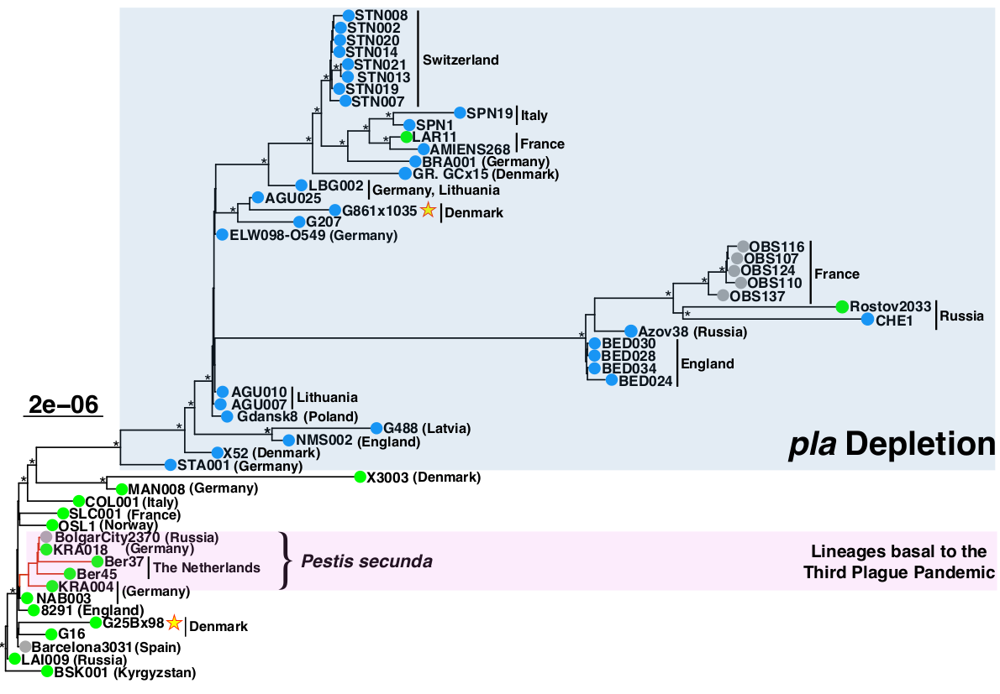
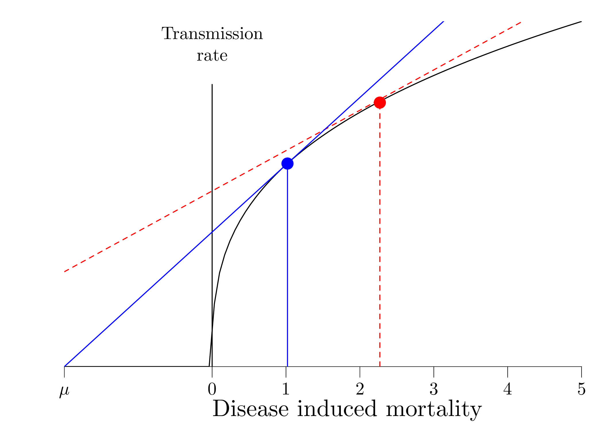
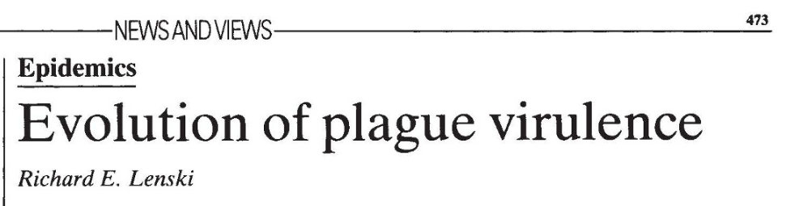
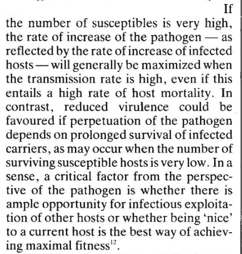
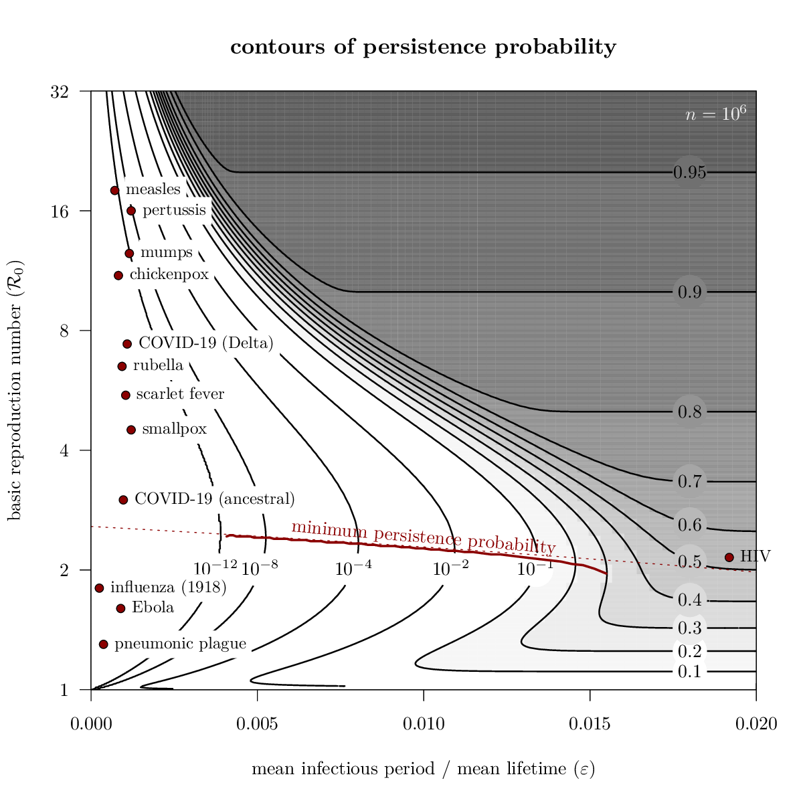
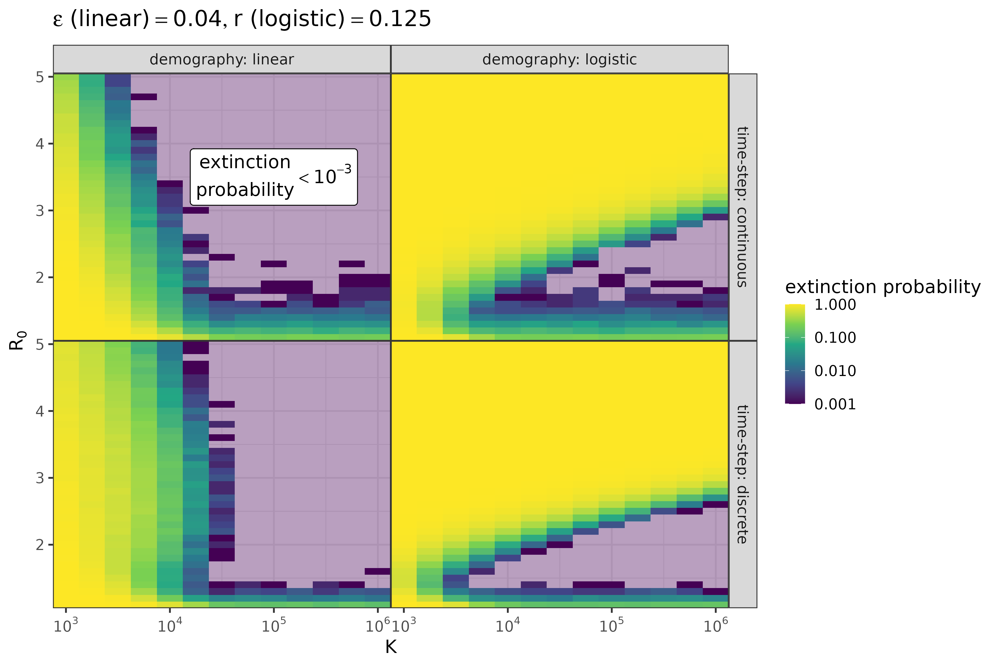
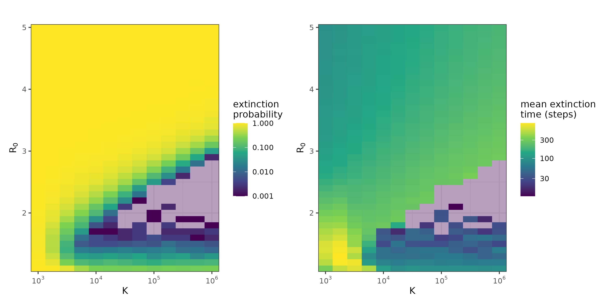
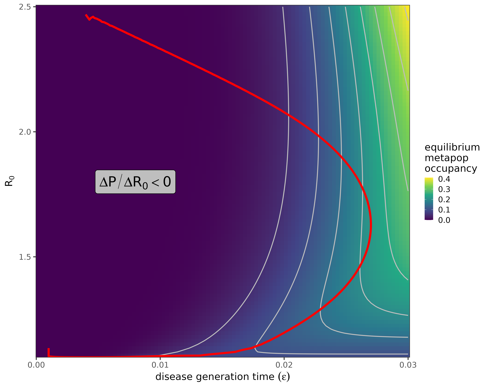
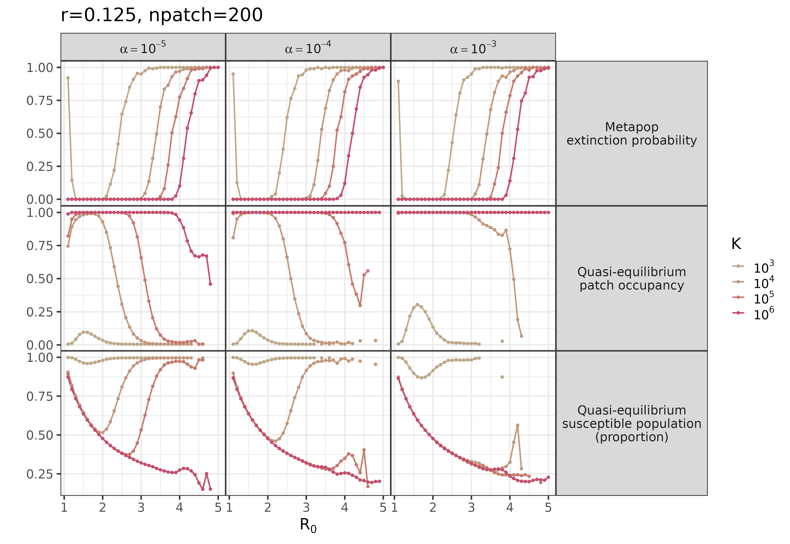
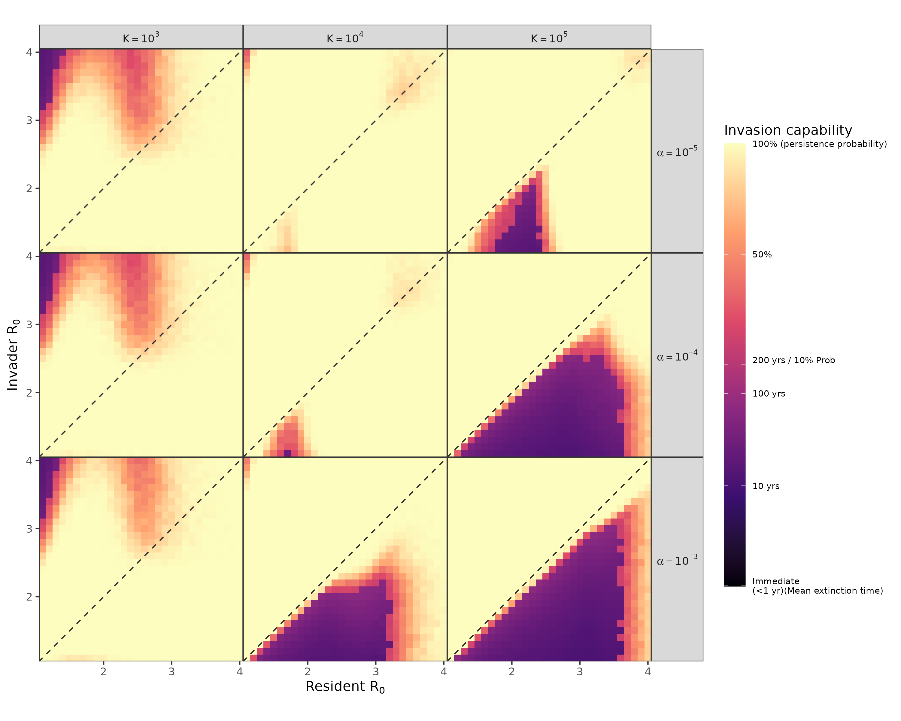

## the question

```{r setup, echo = FALSE, include = FALSE}
library(tidyverse); theme_set(theme_bw())
library(colorspace) ## lighten()
library(kableExtra)
```

<!--

global centering of figures in a Quarto/revealjs doc is ugly, see e.g.
https://github.com/quarto-dev/quarto-cli/issues/
I tried the lua-filter approach, but that messed up the figures that were using
absolute positioning ...
-->

<!-- .refs is style for reference page (small text) -->
<style>
.refs {
   font-size: 14px;
}
.tiny {
   font-size: 10px;
}

h2 { 
 color: #3399ff;		
}
h3 { 
 color: #3399ff;		
}
.title-slide {
   background-color: #55bbff;
}
<!-- https://stackoverflow.com/questions/50378349/force-column-break-in-rmarkdown-ioslides-columns-2-layout -->
.forceBreak { -webkit-column-break-after: always; break-after: column; }
</style>

\newcommand{\rzero}{{\cal R}_0}


What (eco-)evolutionary dynamics drove the repeated evolution of reduced virulence in *Yersinia pestis* in multiple pandemics?

<!-- https://emilhvitfeldt.github.io/quarto-revealjs-editable/
  quarto add emilhvitfeldt/quarto-revealjs-editable
  https://emilhvitfeldt.github.io/quarto-revealjs-editable/getting-started.html
  -->

## acknowledgements

* **Yuyang Zhang** (張雨陽), Jonathan Dushoff, David Earn, Todd Parsons
* Ravneet Sidhu, Hendrik Poinar (ancient DNA work)
* NSERC ($$$)

## plague basics

* vector-borne bacterial disease of rodents
    * rats and fleas
* spillover into human populations
    * human-to-human (or human-vector-human) transmission possible, but unusual
* history:
    * originated Bronze Age, $\approx$ 5-6 KYBP
    * three **pandemics**: 540-750 AD, 1347-18th c. ("the Black Death"), 1850-1960

## the inspiration 

::: {.absolute width=645.5px height=415px left=-94px top=164px}
* @sidhuAttenuationVirulenceYersinia2025: *Y. pestis* **repeatedly** evolved a lower-virulence phenotype, in each pandemic
* ... via copy-number reduction of a plasmid-encoded virulence gene (*Pla*)
:::

{.absolute width=581.5px height=410px left=601px top=82px}

<!--
## experimental mortality data

* mouse injections with varying levels of *Pla* depletion 
* infection mortality decreases, survival time increases

```{r sidhu-mort,echo = FALSE}
dd4 <- read.csv("Sidhu_mort.csv")  |>
    mutate(across(strain, \(x) reorder(factor(x), gene_ratio,
                                       decreasing = TRUE))) |>
    arrange(strain) |>
    mutate(strainx = sprintf("%s\n(%1.1f%% Pla)", strain, gene_ratio) |>
               factor() |> forcats::fct_inorder()) |>
    mutate(event = ifelse(dod==20, 0, 1)) ## censoring
cvec0 <- c("#69BE44", "#49A5DF", "#D5D5D8")
cvec1 <- c(cvec0[1],
           lighten(cvec0[2], c(-0.3, 0, 0.3)),
           cvec0[3])
cvec <- cvec1
theme_set(theme_bw(base_size = 16))

gg_ttd <- ggplot(dd4, aes(x=strainx, y = dod, colour = strain, fill = strain)) +
    geom_dotplot(binaxis="y", stackdir = "center", binwidth = 0.5) +
    geom_boxplot(alpha = 0.2) + 
    expand_limits(y=0) +
    scale_colour_manual(values = cvec) +
    scale_fill_manual(values = cvec) +
    theme(legend.position = "none") +
    labs(y = "day of death", x = "strain")

print(gg_ttd)
```

## classical tradeoff theory

::: {.absolute width=542px height=395px left=0px top=151px}
* $\rzero \propto$ transmissibility ($\textrm{time}^{-1}$) × infectious period
* infectious period $\propto$ 1/virulence
* transmissibility is an increasing, decelerating function of virulence
* $\to$ $\rzero$, $r$ maximum at *intermediate* virulence
:::

{.absolute width=698px height=528px left=573px top=121px}

-->

## tradeoff theory of virulence evolution

::: {.absolute width=598.8px height=402.6px left=-66px top=105px}
* $\rzero \propto$ transmissibility ($\textrm{time}^{-1}$) × infectious period
* infectious period $\propto$ 1/virulence
* **if** transmissibility is an increasing, decelerating function of virulence
* $\to$ $\rzero$, $r$ (growth rate) maximum at *intermediate* virulence
:::

{.absolute width=233px height=50px left=568.4px top=148px}
{.absolute width=345.5px height=105.5px left=696.6px top=62.1px}
{.absolute width=386.1px height=406.8px left=630.6px top=218.7px}

## tradeoff theory doesn't work here!

* assumes transmission occurs continuously
* but fleas move/transmission occurs **at host death** (!)
* → *Pla* depletion uniformly **lowers** $\rzero$ and $r$

## how could lower virulence evolve?

* metapopulation dynamics
   * for plague persistence [@KeelGill2000b]
   * for virulence evolution (@bootsSmall1999, many others)
* lower local (**within-patch**) $\rzero$ could be evolutionarily advantageous

## the story as a cartoon

{.absolute width=1050px height=557px left=0px top=89px}

## metapopulation mechanisms

* **burnout** [@Pars+2024]: probability of local, stochastic disease extinction is highest at $\rzero \approx 2$
* **deterministic mechanisms**: intermediate $\rzero$ → host population size → optimal probability of local outbreaks, more colonization potential?

## persistence probability

{.absolute width=778px height=711px left=0px top=59px}

##  modeling metapopulations?

* patch state?
    * patch occupancy: $\{p_{\varnothing}, p_1, p_2, p_{12},
    N_{\varnothing}, N_1, N_2, N_{12}\}$ **or**
    * multilevel: $S_{i}$, $I_{ij}$ $\in {\mathbb Z}$  ?
* time
    * discrete ($\Delta t$ = 1 epidemic) **or**
    * discrete ($\Delta t$ = 1 disease generation) **or**
    * continuous ?
* demography: linear **or** logistic?

## strategy

* explore effects of demography, time scale (1-species, 1-patch)
* explore effects of $R_0$ on patch occupancy, prevalence in metapopulations
* explore invasion dynamics in two-species model
* how do patch carrying capacity and connectivity affect these results?

## the model

* discrete-time ($\Delta t$ = disease gen/10)
* within-patch infection with hazard $R0_{ij} \times I_{ij}$ $\to$ multinomial outcome
* binomial recovery with hazard $\gamma$
* logistic (Poisson) growth of host population in each patch
* Poisson colonization of infectives at rate $\alpha \sum I_{i.}$

## effects of demography and timestep

{fig-align="center"}

## logistic/continuous

{fig-align="center"}

## one-species metapopulation results

{fig-align="center"}

## model parameters

* $\rzero$ (**within-patch**)  
[captures effects of *Pla* depletion]
* $\alpha$: between-patch transmission
* $r$, $K$: host demography
* (number of metapopulation patches)

## single-strain metapopulation results

{fig-align="center"}

## two strains (pairwise invasion plots)

{fig-align="center"}

## conclusions

* for logistic growth, intermediate $R_0$ may be *best*
* a metapopulation explanation of virulence evolution seems plausible
* multiple, potentially interacting mechanisms

## caveats/next steps/open questions

* substitute more analysis for brute force
* disentangle extinction vs host regulation mechanisms
* parameter estimates: calibrate metapopulation dynamics based on geography?

{.absolute width=459px height=307px left=125px top=372px}

:::: {.absolute width=1035px height=52px left=-42px top=709px}
::: {.tiny}
Flappiefh - Own work from: Natural Earth ; @cesanaOriginEarlySpread2017
::::
:::

## QR code

```{r qrcode, out.width = "90%"}
library("qrcode")
plot(qr_code("https://www.math.mcmaster.ca/bolker/misc/ssc_plaguetalk_2026.html"))
```

## References {.refs}

::: {#refs}
:::

## parameters

```{r param-tab, echo =FALSE, output = 'asis'}
dd <- read_csv("../parameters/parameters.csv") |>
  filter(type == "param", !grepl("nu|rho|c|epsilon", Symbol)) |>
  select(Symbol, Definition, Value, minval, maxval) |>
  ## mutate(across(c(Value, minval, maxval), expSup)) |>
  mutate(Value = ifelse(is.na(minval), Value,
                        sprintf("%s - %s", minval, maxval))) |>
  select(-c(minval, maxval))

kbl(dd, format = "html", escape = FALSE) |>
  column_spec(2, width = "5in")
```
